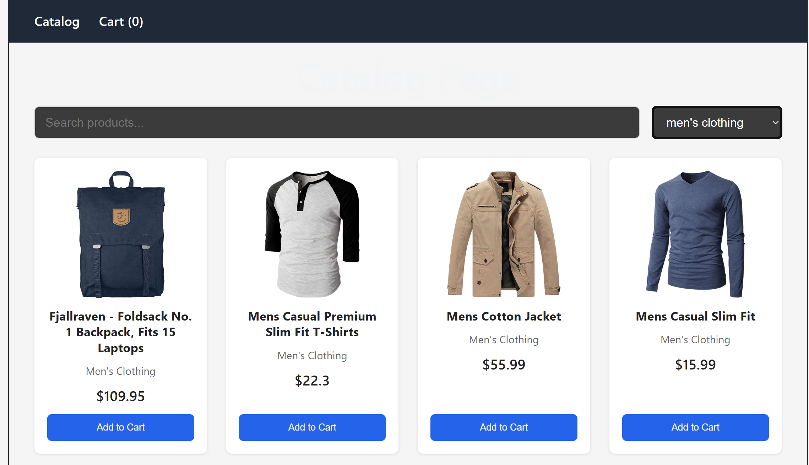
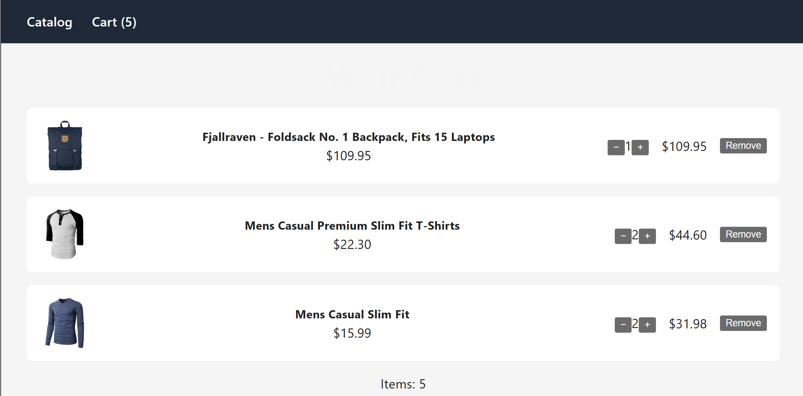
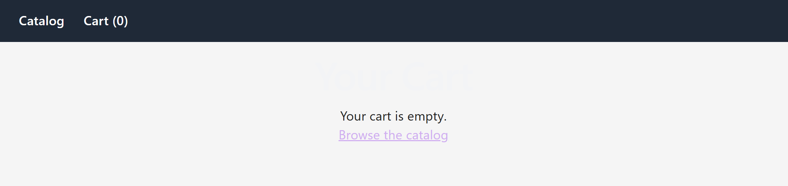

# Mini E-Commerce Product Catalog & Cart

A simplified storefront built with React where users can browse a product catalog, search and filter items by category, and manage a shopping cart with live quantity updates and a running total. All product data comes from a public API — no real payments are processed.

## Features

- Product catalog fetched live from FakeStoreAPI
- Search products by name
- Filter products by category
- Add items to cart, adjust quantities with +/- controls, or remove them
- Running cart total and item count, visible in the navbar
- Client-side routing between Catalog and Cart pages using React Router
- Loading, error, and empty states handled on both the Catalog and Cart pages
- Responsive layout that adapts to desktop and mobile widths

## Technologies Used

- React (functional components + hooks: useState, useEffect, useContext)
- React Router (react-router-dom)
- React Context API for shared cart state across pages
- FakeStoreAPI (https://fakestoreapi.com) for product data
- Vite as the build tool and dev server
- Plain CSS for styling

## Setup Instructions

1. Clone this repository:
git clone https://github.com/Sandeshacharya385/ecommerce-app.git
2. Navigate into the project folder:
cd ecommerce-app
3. Install dependencies:
npm install
4. Start the development server:
npm run dev
5. Open the URL shown in the terminal (typically http://localhost:5173) in your browser.

## Screenshots

## Known Limitations

- Cart contents are not persisted with localStorage — the cart resets on a page refresh.
- No pagination — all products from the API load at once.
- No checkout/payment flow — this is a catalog and cart demo only, as specified in the assignment.

- Cart contents are not persisted with localStorage — the cart resets on a page refresh.

- Cart contents persist across page refreshes using localStorage

## Author
Sandesh Acharya